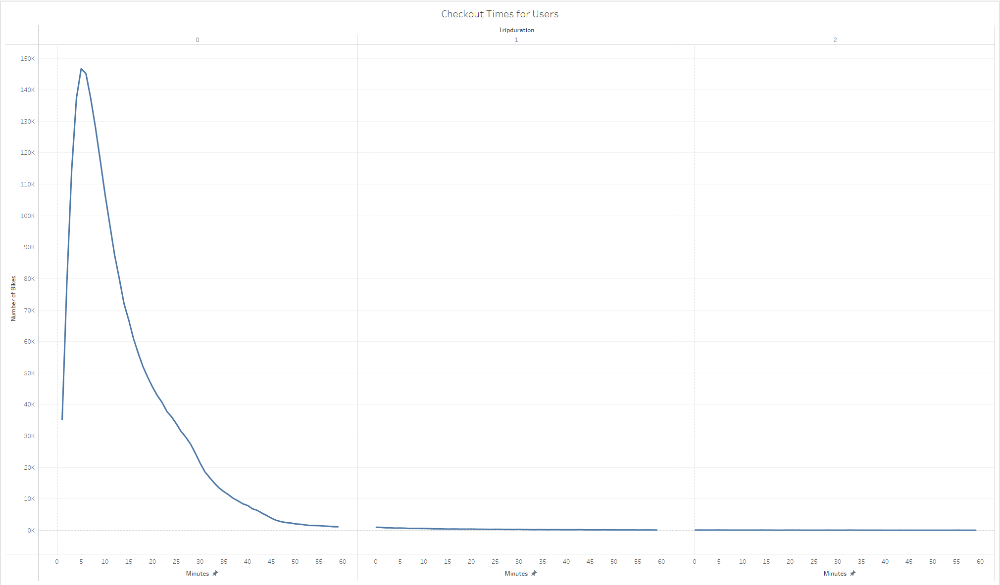
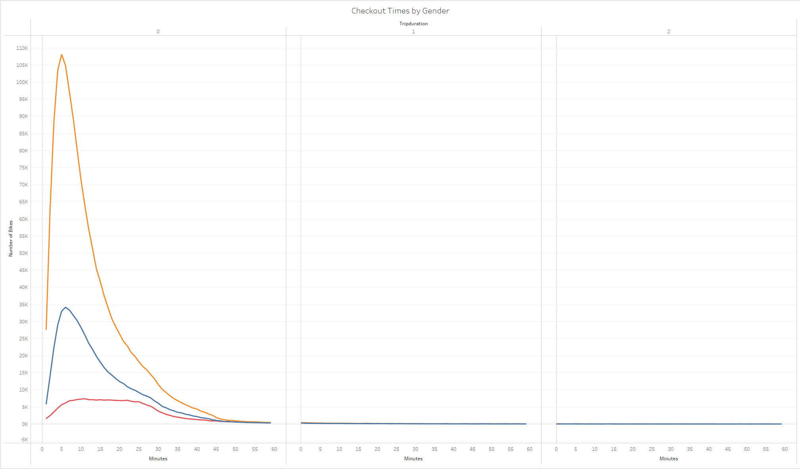
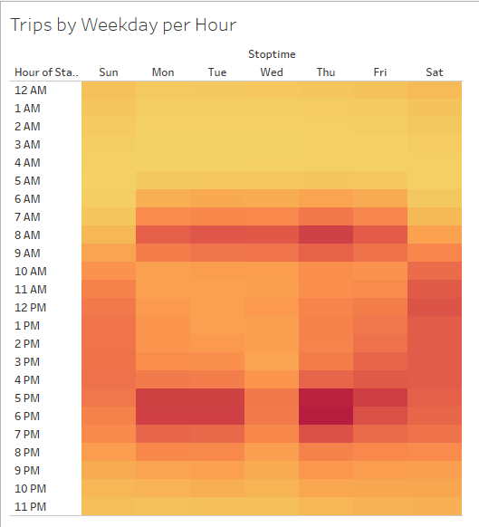
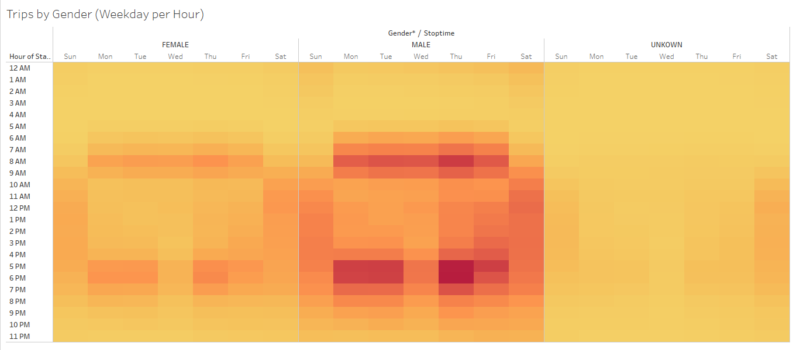
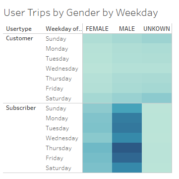
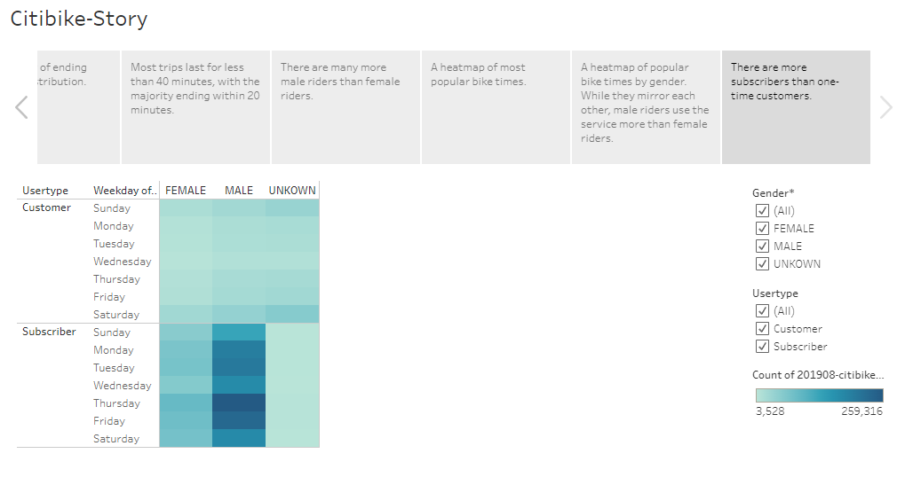

# Citi Bikes - Module 15 Challenge
UNC Chapel Hill Data Analytics Bootcamp

## Overview of Project
For Module 15, Python, Jupyter Notebook, and Tableau were used to clean and analyze a Citi Bike dataset in New York City from August of 2019. The goal was to show the distribution of rides among all riders as well as split by gender.

## Method & Results
### Part 1 - Cleaning Citi Bike Trip Data
Using Python in Jupyter Notebook, the raw csv (not included in this repository due to its large size) was cleaned to change trip duration to datetime format to more effectively analyze the dataset using Tableau. After altering the data types, the csv was exported to use in Tableau.

### Part 2 - Creating Visualizations for Analysis
Using Tableau, several visualizations were created:
- How long were bikes checked out for all riders and genders?

Most users complete their rides within 40 minutes, with the majority of riders spending less than 20 minutes. When separated by gender, male, female, and unknown riders follow similar trends, and the large disparity between the number of male riders and the number of female/unknown riders becomes apparent.

- How many trips are taken by the hour for each day of the week (for all riders and genders)?

Peak hours on weekdays were 7:00-9:00am and 5:00-7:00pm, and were fairly evenly demanded on weekends from 11:00am-6:00pm. When separated by gender, the three categories follow similar trends, but again male riders' patterns are far more apparent than those of female and unknown riders.

- Which days of the week might a user be more likely to check out a bike, by type of user and gender?

A similar map was created to show the total number of trips per gender over each day of the week, separated by one-time customers and subscribers. There are significantly more subscribers using the Citi Bike service than one-time users.

### Part 3 - Creating a Story
[--Click me to see the story--](https://public.tableau.com/app/profile/stacy.burton/viz/Citibike-Story_16816801251600/Citibike-Story?publish=yes)

Using these visualizations as a base, a Tableau story was created to support the key findings of this analysis. Two additional visualizations were added - one map to show the places customers began their bike rides, and another to show the ending locations - as well as a slide showing the total number of rides over the course of the month.

## Summary
As seen from the total number of rides (2.3 million) in one month, it can be concluded that Citi Bike is successful in this area. However, the dataset only applies to one month (August) from one year (2019), and only pertains to the data collected in New York City. Since the aim is to expand to Des Moines, the results could be very different. New York City is a popular tourist destination, and has a different layout and population density compared to Des Moines. Using the conclusions from this NYC dataset is a good start, but a more accurate representation may be a longer-term (i.e. over the course of one or more years) analysis of areas built similarly to Des Moines, with a similar climate and number of tourists.
